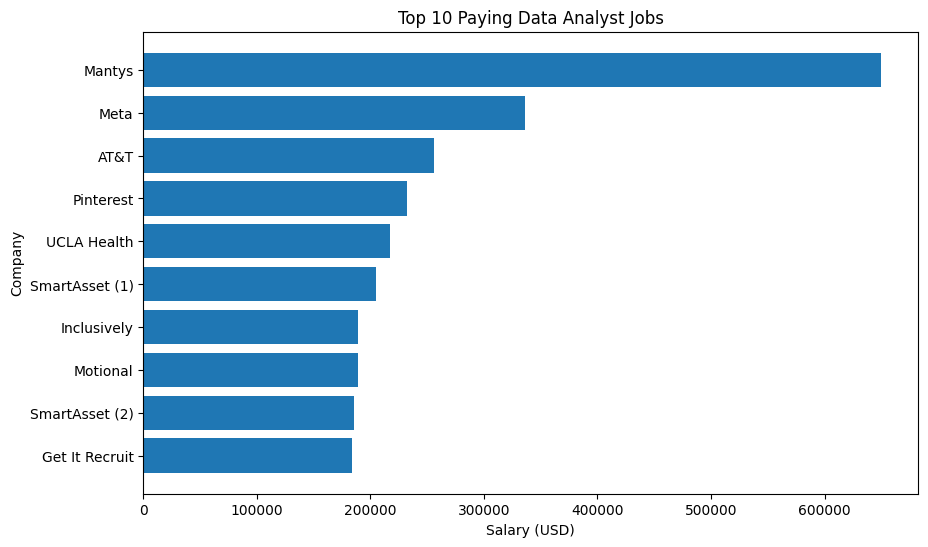
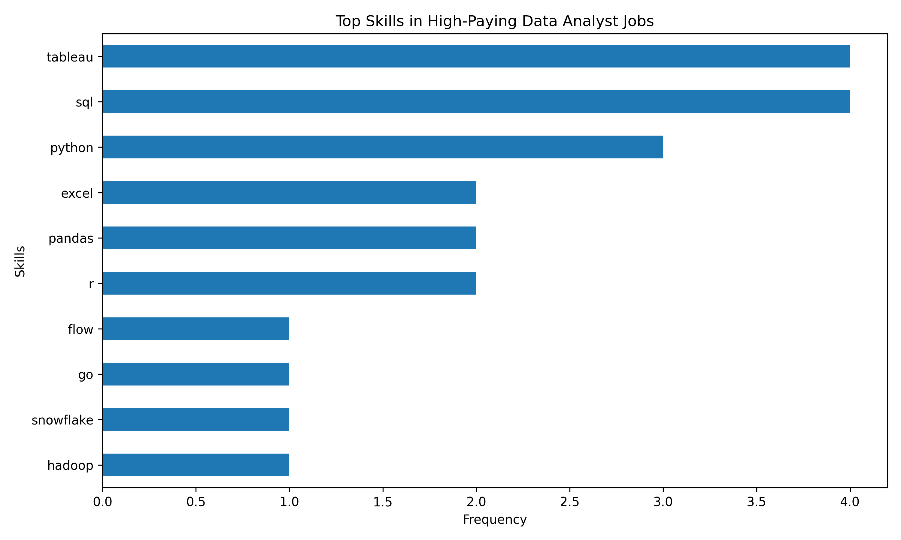

# Introduction
Dive into the data job market! Focusing on data analyst roles, this project explores
top-paying jobs, in-demand skills, & where high demand meets high salary in data analytics.

SQL Queries? Check them out here: [project_sql folder](/SQL_Project_Data_Job/sql_load/)

# Background
Driven by a quest to navigate the data analyst job market more effectively, this project was born from
a desire to pinpoint top-paid & in-demand skills, streamlining others work to find optimal jobs.

Data hails from my [SQL Course] (then the link). It’s packed with insights on job titles, salaries, locations,
& essential skills.

### The questions I wanted to answer through my SQL queries were:
1. What are the top-paying data analyst jobs?
2. What skills are required for these top-paying jobs?
3. What skills are most in demand for data analysts?
4. Which skills are associated with higher salaries?
5. What are the most optimal skills to learn?

#Tools I Used
For my deep dive into the data analyst job market, I harnessed the power of several key tools:

-**SQL**: The backbone of my analysis, allowing me to query the database & unearth critical insights.
-**PostgreSQL**: The chosen database management system, ideal for handling the job posting data.
-**Visual Studio Code**: My go-to for database management & executing SQL queries.
-**Git & Github**: Essential for version control & sharing my SQL scripts & analysis, ensuring collaboration & project 
tracking.

# The Analysis
Each query for this project aimed at investigating specific aspects of the data analyst job market.
Here’s how I approached each question:

### 1. Top Paying Data Analyst Jobs
To identify the highest-paying roles, I filtered data analyst positions by average yearly salary & location,
focusing on remote jobs. This query highlights the high paying opportunities in the field.

```sql
SELECT job_id,
       job_title_short,
       name as Company_Name,
       job_location,
       job_schedule_type,
       salary_year_avg,
       job_posted_date

FROM job_postings_fact

LEFT JOIN company_dim on job_postings_fact.company_id = company_dim.company_id

where job_title_short = 'Data Analyst' AND
      job_location = 'Anywhere' AND
      salary_year_avg IS NOT NULL

ORDER BY salary_year_avg DESC

LIMIT 10;

```

Here’s the breakdown of the top data analyst jobs in 2023:
-**Wide Salary Range:** Top 10 paying data analyst roles span form $184,00 to $650,000,
indicating significant salary potential in the field.

-**Diverse Employers:** Companies like SmartAssest, Meta & AT&T are among those offering 
high salaries, showing a broad interest across different industries.

-**Job Title Variety:** There’s a high diversity in job titles, from Data analyst to Director of Analytics,
reflecting varied roles & specializations within data analytics.

**(Top Paying Roles)**  (so this is something that I can get graphical representation from Chatgpt and paste it below)

*Bar graph visualizing the salary for the top 10 salaries for data analysts; ChatGPT  generated this graph from my SQL query results*  
### 2. Skills for Top Paying Jobs
To understand what skills are required for the top-paying jobs, I joined the job postings with the skills data, providing insights into what employers value for high-compensation roles.

```sql
WITH top_paying_jobs AS(
SELECT job_id,
       job_title_short,
       name as Company_Name,
       salary_year_avg

FROM job_postings_fact

LEFT JOIN company_dim on job_postings_fact.company_id = company_dim.company_id

where job_title_short = 'Data Analyst' AND
      job_location = 'Anywhere' AND
      salary_year_avg IS NOT NULL

ORDER BY salary_year_avg DESC

LIMIT 10
)

SELECT top_paying_jobs.*,skills 
FROM top_paying_jobs
INNER JOIN skills_job_dim on top_paying_jobs.job_id = skills_job_dim.job_id
INNER JOIN skills_dim on skills_job_dim.skill_id = skills_dim.skill_id

ORDER BY salary_year_avg DESC;
```

Here’s the breakdown of the most demanded skills for the top 10 highest paying data analyst jobs in 2023:

-**SQL** is leading with a bold count of 8.
-**Python** follows closely with a bold count of 7.
-**Tableau is also highly sought after, with a bold count of 6. Other skills like **R**,**Snowflake**,
**Pandas**, and **Excel** show varying degrees of demand.

!(Top Paying Skills) 
*Bar graph visualizing the count of skills for the top 10 paying jobs for data analysts;
ChatGPT generated this graph from my SQL query results*

### 3. In-Demand Skills for Data Analysts

This query helped identify the skills most frequently requested in job postings,
directing focus to areas with high demand.

```sql
SELECT 
skills,
count(skills_job_dim.job_id) AS Demand_Count

from job_postings_fact

INNER JOIN skills_job_dim on job_postings_fact.job_id = skills_job_dim.job_id
INNER JOIN skills_dim on skills_job_dim.skill_id = skills_dim.skill_id

WHERE job_title_short = 'Data Analyst'

GROUP BY skills

ORDER BY Demand_Count DESC

LIMIT 5;
```
Here’s the breakdown of the most demanded skills for data analysts in 2023
-**SQL** and **Excel** remain fundamental, emphasizing the need for strong foundational skills
in data processing & spreadsheet manipulation.
-**Programming** and **Visualizarion Tools** like **Python**,**Tableau**,  and **Power BI** are    
essential, pointing towards the increasing importance of technical skills in data storytelling and decision
support.
| Skill     | Demand Count |
|----------|-------------|
| SQL      | 92628       |
| Excel    | 67031       |
| Python   | 57326       |
| Tableau  | 46554       |
| Power BI | 39468       |

*Table of the demand for the top 5 skills in data analyst job postings*

### 4. Skills Based on Salary
Exploring the average salaries associated with different skills revealed which skills are the highest paying.
```sql
SELECT skills, round(Avg(salary_year_avg),0) as Avg_Salary

from job_postings_fact

INNER JOIN skills_job_dim on job_postings_fact.job_id = skills_job_dim.job_id
INNER JOIN skills_dim on skills_job_dim.skill_id = skills_dim.skill_id

WHERE job_title_short = 'Data Analyst' AND
      salary_year_avg IS NOT NULL
       AND job_work_from_home = True

GROUP BY skills

order BY Avg_Salary DESC

LIMIT 25;
```
-**High Demand for Big Data & ML Skills:** Top Salaries are commanded by analysts skilled in big data technologies (Couchbase,etc), machine learning tools(DataRobot,Jupyter), & Python libraries (Pandas,NumPy), reflecting valuation of data processing & predictive modelining
-**Software Development & Development Proficieny:** Knowledge in development & deployment tools (GitLab,Kubernetes,Airflow) indicates a lucrative crossover b/w data analysis & engineering, with a premium on skills that facilitate automation & efficient data pipeline management
-**Cloud Computing Exoertise:** Fmailiarity with cloud & data engineeering tools (Elasticsearch, Databricks, GCP) underscroes the growing importance of cloud-based analytics envirnoments, suggesting that cloud proficiency significantly boosts earning potential in data analytics.

| Skill         | Avg Salary ($) |
|--------------|---------------:|
| Pyspark      | 208172         |
| Bitbucket    | 189155         |
| Couchbase    | 160515         |
| Watson       | 160515         |
| Datarobot    | 155486         |
| GitLab       | 154500         |
| Swift        | 153750         |
| Jupyter      | 152777         |
| Pandas       | 151821         |
| Elasticsearch| 145000         |

*Table of the average salary for the top 10 paying skills for data analyst

### 5. Most Optimal Skills to learn
Combining insights from demand & salary data, this query aimed to pinpoint skills that are both high demand and high paid, offering a strategic focus for skill development

```sql
SELECT skills_dim.skill_id,
       skills_dim.skills,
       count(skills_job_dim.job_id) as Demand_Count,
       round(avg(job_postings_fact.salary_year_avg),0) AS avg_salary

from job_postings_fact

INNER JOIN skills_job_dim on job_postings_fact.job_id = skills_job_dim.job_id
INNER JOIN skills_dim on skills_job_dim.skill_id = skills_dim.skill_id

where job_title_short = 'Data Analyst'
      AND salary_year_avg IS NOT NULL
      AND job_work_from_home = TRUE

GROUP BY skills_dim.skill_id  

HAVING count(skills_job_dim.job_id)>10

ORDER BY avg_salary DESC, Demand_Count DESC

LIMIT 25;
```
| Skill      | Demand Count | Avg Salary ($) |
|-----------|-------------:|---------------:|
| Go        | 27           | 115320         |
| Confluence| 11           | 114210         |
| Hadoop    | 22           | 113193         |
| Snowflake | 37           | 112948         |
| Azure     | 34           | 111225         |
| BigQuery  | 13           | 109654         |
| AWS       | 32           | 108317         |
| Java      | 17           | 106906         |
| SSIS      | 12           | 106683         |
| Jira      | 20           | 104918         |

*Table of the most optimal skills for data analyst sorted by salary*

Here's a breakdown of the most optimal skills for data analyst:

- **High-Demand Programming Languages:** Python & R stand out for their strong demand, with Python alone appearing in 236 job postings.  
  These languages are essential for data analysis, enabling data manipulation, statistical modeling, and automation across various industries.

- **High-Paying Specialized Skills:** Tools like Go, Snowflake, and Hadoop offer some of the highest average salaries despite lower demand counts.  
  This shows that niche expertise in big data and cloud technologies can significantly increase earning potential.

- **Balanced Cloud & Data Technologies:** AWS, Azure, and BigQuery provide a solid mix of demand and competitive salaries.  
  These platforms are widely used in modern data workflows, making them valuable skills for both job security and career growth.

# What I Learned
Throughout this adventure, I’ve turbocharged my SQL toolkit some serious firepower:
- **Complex Query Crafting:** Mastered the art of advance SQL, merging tables like a pro & wielding 
WITH clauses for ninja-level temp table maneuvers.
-**Data Aggregation:** Got cozy with GROUO BY & turned aggregate functions like COUNT() & AVG()
into my data-summarizing sidekicks.
-**Analytical Wizardry:** Leveled up my real-world puzzle-solving skills, turning questions
into actionable, insightful SQL queries.

# Conclusions
### Insights
From the analysis, several general insights emerged:
1. **Top-Paying Data Analyst Jobs**: The highest-paying jobs for data analysts that
allow remote work offer a wide range of salaries, the highest at $650,000!
2. **Skills for Top-Paying Jobs**: High-paying data analyst jobs require advance proficiency
in SQL, suggesting it’s a critical skill for earning a top salary.

3. **Most In-Demand Skills**: SQL is also the most demanded skill in the data analyst job market,
thus making it essential for job seekers.
4. **Skills with Higher Salaries**: Specialized skills, such as SVN & Solidity, are associated with the highest
average salaries, indicating a premium on niche expertise.

5. **Optimal Skills for Job Market Value**: SQL leads in demand and offers for a high average salary, positioning 
it as one of the most optimal skills for data analysts to learn to maximize their market value.


### Closing Thoughts
This project enhanced my SQL skills & provided valuable insights into the data analyst job market. The findings
from the analyst serve as a guide to prioritizing skill development & job search efforts. Aspiring data analysts can 
better position themselves in a competitive job market by focusing on high-demand, high-salary skills. This exploration
highlights the importance of continuous learning & adaptation to emerging trends in the field of data analytics.
